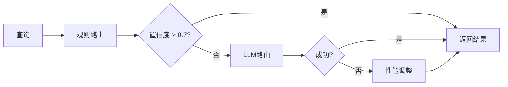

# Manatrix - Roman Legion + Matrix

**Manatrix** (Roman Legion + Matrix) 是一个 AI 驱动的智能密码猜测与渗透测试框架。名称融合了罗马百人队(Matrix Cohort)的组织协作理念与矩阵(Matrix)的智能化能力。

基于 MAMBA + 差分进化 + LLM 的智能密码猜测系统，以及基于 RAG 知识库 + 多专家系统 + 攻击小组的知识增强型 LLM 自动化渗透测试框架。

## 核心特性

### 密码猜测系统
- **MAMBA 序列模型**: 基于 Selective State Space 的密码生成
- **差分进化优化**: 多策略 DE、SHADE、并行 DE
- **LLM 信息提取**: DeepSeek 多阶段提取目标特征
- **高级采样**: Beam Search、Typical、Contrastive、Mirostat
- **密码规则引擎**: 30+ Hashcat 风格规则

### 渗透测试框架
- **RAG 知识库**: ChromaDB 向量存储 + BM25 关键词搜索 + 语义嵌入
- **多专家系统**: 20 个领域专家 (侦察/漏洞/利用/后渗透/凭据/横向移动/Web/无线安全/云安全/AD域/IoT/社工/供应链/逆向工程/硬件安全等)
- **自主攻击代理**: Claude Code 风格自主渗透测试智能体 (ManatrixAgent)
- **攻击小组**: 7 名成员协作 (指挥官/侦察兵/分析师/突击手/幽灵/猎手/幽灵)
- **工具编排器**: 15+ 工具、4 条预置工具链
- **自我改进循环**: 经验存储 → 教训库 → 课程学习 → 元学习器

## 安装

### 从源码安装

```bash
git clone https://github.com/RomanCohort/manatrix.git
cd manatrix
pip install -e .
```

### 专家路由决策图



## 功能特性

### 密码猜测

#### 核心功能
- **MAMBA 序列模型**: 基于 Selective State Space 的密码生成，支持 CUDA 加速
- **差分进化优化**: MultiStrategyDE, SHADE, ParallelDE, StructuredDE
- **LLM 信息提取**: DeepSeek 多阶段提取 (Extract→Validate→Refine) + 并行提取

#### 高级采样
- Beam Search / Diverse Beam Search
- Typical Sampling / Contrastive Search
- Mirostat / Tail-free / Eta-cutoff Sampling
- Temperature Scheduling (constant, linear, cosine)

#### 密码规则引擎 (Hashcat 风格)
- 30+ Hashcat 规则: `l`, `u`, `c`, `t`, `r`, `d`, `f`, `$`, `^`, `s` 等
- 规则组合与优化
- 常见密码模式匹配

#### PCFG 生成器
- 概率上下文无关语法 (L=字母, D=数字, S=特殊)
- 从数据集自动训练语法规则
- 按概率排序生成

#### 密码强度评估
- 多维度评估 (zxcvbn-lite)
- 信息熵计算 (字符集熵/模式熵)
- 猜测次数与破解时间估算

#### 模型压缩
- INT8 动态量化
- 知识蒸馏
- 模型剪枝

### 渗透测试框架

#### 攻击图 (Attack Graph)
- 有向图建模：主机、服务、漏洞、凭据、权限节点
- 从 Nmap/Nessus/手动输入自动构建
- 攻击路径搜索 (BFS/最短路径)
- 风险评分与关键节点识别
- Mermaid / Graphviz DOT / D3.js 可视化

#### 知识依赖图 (Knowledge Dependency Graph)
- **CVE/NVD 数据库**: 在线查询 + 本地缓存
- **MITRE ATT&CK**: 预置 15+ 常用技术，支持加载完整 STIX 数据
- **Exploit-DB**: 预置 10+ 常见漏洞利用，含 Metasploit 模块映射
- 自动 CVE ↔ ATT&CK 技术关联
- 依赖链推理 (CVE → 技术 → 前置条件 → 后果)

#### RAG 知识库系统
- **向量存储**: ChromaDB 持久化 + JSON 持久化回退
- **语义嵌入**: sentence-transformers (all-MiniLM-L6-v2) + 哈希嵌入回退
- **混合检索**: 语义搜索 (cosine) + 关键词搜索 (BM25) + Reciprocal Rank Fusion
- **知识索引**: 11 条预置 CVE、15 条 ATT&CK 技术、15 个工具文档
- **经验检索**: 基于当前状态搜索相似历史经验

### 多专家系统 (Multi-Expert System)

**20 个领域专家**:

| # | 专家 | 工具数 | ATT&CK 技术 | 输入 | 输出 |
|---|------|--------|-------------|------|------|
| 1 | 侦察专家 | 15+ | T1595, T1592, T1589 | target | hosts, services, ports |
| 2 | 漏洞专家 | 12+ | T1595.002, T1046, T1082 | target, services | vulnerabilities, CVE |
| 3 | 利用专家 | 10+ | T1190, T1203, T1068 | target, vulns | shell, exploit_result |
| 4 | 后渗透专家 | 20+ | T1003, T1068, T1078 | has_shell, os | creds, privilege_level |
| 5 | 凭据专家 | 12+ | T1110, T1555, T1003 | target, services | credentials, cracked_hashes |
| 6 | 横向移动专家 | 15+ | T1021, T1047, T1563 | hosts, creds | new_access, pivot_hosts |
| 7 | Web安全专家 | 18+ | T1190, T1056, T1078 | target, url | xss, sqli, rce |
| 8 | 无线安全专家 | 10+ | T1552, T1547 | wifi_target | handshake, wep_key |
| 9 | 云安全专家 | 12+ | T1580, T1526, T1110 | cloud_target | iam_issues, bucket_access |
| 10 | AD域专家 | 15+ | T1558, T1550, T1091 | domain_target | kerberos_issues, ad_info |
| 11 | IoT安全专家 | 12+ | T1595, T1046 | iot_target | firmware, default_creds |
| 12 | 社工专家 | 8+ | T1566, T1187 | target_info | phishing_email, pretext |
| 13 | 供应链安全专家 | 6+ | T1195, T1543 | target_pkg | supply_chain_risks |
| 14 | **逆向工程专家** | **73** | T1627 | binary_file | decompiled_code, vulns |
| 15 | 社会工程专家 | 10+ | T1566, T1591 | target_info | phishing, pretext |
| 16 | 网络协议专家 | 8+ | T1552, T1046 | protocol_target | auth_issues, protocol_vulns |
| 17 | 密码分析专家 | 6+ | T1110, T1555 | hash, cipher | plain_password, key |
| 18 | 逆向分析专家 | 12+ | T1027, T1627 | binary | function_map, exploits |
| 19 | 漏洞研究专家 | 10+ | T1203, T1068 | vuln_type | poc, exploit_dev |
| 20 | **硬件安全专家** | **100+** | T1200, T0855 | hw_target | keys, firmware_dump, debug_access |


**专家路由器 (ExpertRouter)**:

三种路由策略逐级提升精度：

| 策略 | 机制 | 何时触发 |
|------|------|----------|
| 规则路由 | 关键词匹配 + 阶段映射 + 状态条件评分 | 始终先执行 |
| LLM 路由 | 调用 LLM 对状态进行分类 | 规则路由置信度 < 0.7 |
| 性能调整 | 根据专家历史成功率交换主/辅助角色 | 主专家成功率 < 30% |

**Bio-Gated MoE 2.0 (生物门控混合专家)**:

基于生物神经元门控机制的新一代路由系统，模拟生物体的情绪和记忆对决策的影响。

```
┌─────────────────────────────────────────────────────────────┐
│  传统 MoE: G(x) = softmax(W·x)                             │
│                                                             │
│  BioMoE: G(x,m,e) = softmax(                                 │
│              Content(x) +                                  │
│              α·Membrane(m) +                                │
│              β·Emotion(e)                                    │
│           )                                                 │
└─────────────────────────────────────────────────────────────┘
```

| 组件 | 功能 | 生物类比 |
|------|------|---------|
| **Content Gate** | 标准MoE路由，基于输入内容 | 感知输入 |
| **Membrane Potential** | 累积历史使用经验 | 长期记忆/突触权重 |
| **Emotional State** | 动态情绪状态（4维） | 情绪影响决策 |

**情绪状态维度**:

- Arousal (唤醒度): 兴奋程度，影响探索/利用倾向
- Valence (效价): 正面/负面情绪
- Dominance (支配度): 控制感
- Persistence (专注度)

**自动反馈机制**:

每次前向传播自动更新：
- 门控置信度 → 兴奋度调整
- 专家使用频率 → 膜电位更新
- 探索奖励: 少用的专家更容易被激活

```
高置信输入 → 兴奋度↑ → 探索新策略
低置信输入 → 兴奋度衰减 → 稳定使用已知策略
```

**参数配置**:
```python
BioMoEConfig(
    d_model=512,
    num_experts=8,
    top_k=2,
    membrane_decay=0.9,    # 遗忘率
    membrane_update=0.3,   # 更新率
    emotion_decay=0.85,    # 情绪衰减
    emotion_update=0.3,   # 情绪更新
    auto_feedback=True      # 启用自动反馈
)
```

**专家分析逻辑 (analyze 方法)**:

每个专家根据状态条件给出不同的建议：

```
侦察专家:
  无主机/无扫描 → 推荐nmap服务版本扫描
  有主机无服务 → 详细端口扫描
  有服务       → nuclei漏洞扫描 + OSINT
  扫描>5次     → 警告IDS/IPS风险

漏洞专家:
  无漏洞       → 推荐nuclei+nikto扫描
  有漏洞       → 按严重程度排序 + searchsploit搜索公开利用

利用专家:
  无漏洞       → 等待漏洞发现
  高危漏洞     → metasploit利用 + msfvenom生成payload
  Windows目标  → 警告AMSI/Defender
  Linux目标    → 警告SELinux

逆向工程专家 (73 工具):
  .apk 文件   → jadx反编译 + apktool资源提取 + frida动态分析
  .exe/.dll   → dnSpy/ilSpy反编译 + Ghidra二进制分析
  .jar 文件   → CFR/Procyon反编译
  .bin 固件   → binwalk提取 + firmware-mod-kit解包
  ELF 二进制  → radare2/Ghidra反汇编 + checksec安全检查
  自动阶段    → 文件识别→静态分析→动态调试→漏洞利用开发
```

**逆向工程专家工具分类**:

| 类别 | 工具 | 数量 |
|------|------|------|
| 反汇编/反编译 | Ghidra, IDA Pro, radare2, Binary Ninja, Hopper, RetDec, Cutter | 7 |
| Android RE | jadx, apktool, dex2jar, smali, Frida, Xposed, Objection, MobSF | 8 |
| .NET/Java RE | dnSpy, ILSpy, dotPeek, CFR, Procyon, JD-GUI, Krakatau | 7 |
| 二进制分析 | strings, binwalk, file, objdump, readelf, checksec, LIEF | 7 |
| 调试器 | GDB, x64dbg, OllyDbg, WinDbg, LLDB, radare2 debugger | 6 |
| Fuzzing | AFL, libFuzzer, honggfuzz, Peach, Radamsa, zzuf, Jackalope | 7 |
| 漏洞利用开发 | pwntools, ROPgadget, Ropper, one_gadget, angr, Unicorn | 6 |
| 补丁对比 | BinDiff, Diaphora, patchdiff2, turbodiff, DarunGrim | 5 |
| 符号执行 | angr, KLEE, SAGE, Mayhem | 4 |
| 固件分析 | binwalk, firmware-mod-kit, Jeager, FACT | 4 |
| 内存取证 | Volatility, Volatility3 | 2 |
| 代码仿真 | Unicorn, QEMU, ARMware | 3 |
| 反编译器 (其他) | Ghidra (multi-arch), RetDec, Snowman | 3 |
| 辅助工具 | ltrace, strace, ldd, nm, size, readelf, capstone | 7 |

**硬件安全专家 (100+ 工具)**:

| 类别 | 工具 | 说明 |
|------|------|------|
| 侧信道分析 | ChipWhisperer, OpenADC, Riscure Inspector, EM Probes | 功耗分析(CPA/DPA)、电磁分析、时序攻击 |
| 故障注入 | Voltage Glitch, Clock Glitch, Laser FI, EM FI | 电压/时钟/电磁/激光故障注入 |
| 调试接口 | JTAGulator, OpenOCD, JLink, CMSIS-DAP, STLink | JTAG/SWD调试接口利用 |
| 串口通信 | Minicom, Picocom, FTDI, CP210x, PL2303 | UART串口识别与连接 |
| 总线分析 | Flashrom, i2cdetect, Saleae Logic, Sigrok | SPI/I2C总线嗅探与读取 |
| RFID/NFC | Proxmark3, MFOC, MFCUK, libnfc, nfcpy | 标签读取、破解、克隆 |
| 汽车/工控 | CAN-utils, ICSim, CanMatrix, OpenDBC | CAN总线分析、ECU攻击、OBD-II |
| 无线硬件 | HackRF, BladeRF, USRP, RTL-SDR, GNU Radio | SDR信号捕获与分析 |
| ZigBee | KillerBee, ZBSniffer, RfCat | ZigBee协议嗅探与攻击 |
| PCB逆向 | Microscope, KiCad, Logic Analyzer | 电路板走线提取、网表重建 |
| 芯片安全 | TPM2-tools, GlobalPlatform, Cardpeek | TPM/HSM/安全芯片攻击 |
| 物理安全 | Lockpick, Shimming, Impressioning | 机械锁/电子锁/门禁绕过 |
| 冷启动 | Inception, Memdrip, DDR Tools | 内存密钥提取、冷启动攻击 |

**ExpertAdvice 数据结构**:

```python
@dataclass
class ExpertAdvice:
    expert_type: ExpertType           # 专家类型
    summary: str                      # 建议摘要
    recommended_actions: List[dict]   # 推荐行动列表 [{type, tool, description, params}]
    tools_to_use: List[str]           # 建议使用的工具
    confidence: float                 # 置信度 (0-1)
    reasoning: str                    # 推理过程
    warnings: List[str]               # 风险警告
    alternatives: List[dict]          # 替代方案
    relevant_cves: List[str]          # 相关CVE
    relevant_techniques: List[str]    # 相关ATT&CK技术
```

**使用示例**:

```python
from models.expert_router import create_default_router

# 创建路由器 (自动注册19个专家)
router = create_default_router(llm_provider=llm, rag_retriever=rag)

# 路由查询
result = router.route_query(
    query="如何利用发现的SSH服务和Log4j漏洞",
    state={"phase": "exploitation", "services": ["ssh", "http"],
           "vulnerabilities": ["CVE-2021-44228"]}
)

# 主专家建议
print(result["routing_decision"].primary_expert)  # EXPLOITATION
print(result["routing_decision"].confidence)       # 0.85
print(result["primary_advice"].summary)            # "建议使用metasploit..."
print(result["primary_advice"].tools_to_use)       # ["metasploit", "msfvenom"]

# 辅助专家建议
for advice in result["supporting_advice"]:
    print(f"{advice.expert_type.value}: {advice.summary}")

# 记录结果 (影响性能调整)
router.record_outcome(ExpertType.EXPLOITATION, was_successful=True)
```

#### 攻击小组 (Attack Team)
7 名成员组成协作攻击小组：

| 成员 | 角色 | 对应专家 |
|------|------|----------|
| Commander | 指挥官/决策者 | 综合分析 |
| Scout | 侦察兵 | 侦察专家 |
| Analyst | 分析师 | 漏洞专家 |
| Striker | 突击手 | 利用专家 |
| Ghost | 幽灵 | 后渗透专家 |
| Hunter | 猎手 | 凭据专家 |
| Phantom | 幽灵 | 横向移动专家 |

**会议类型与流程**:
```
Briefing (简报)    → 初始情况通报，全员参与
    ↓
Planning (规划)    → 根据阶段选择相关专家制定攻击计划
    ↓
Review (审查)      → 进度检查，有漏洞/凭据/沦陷主机时邀请相关专家
    ↓
Debrief (总结)     → 行动后总结，提取经验教训
    ↓
Emergency (紧急)   → 遇到问题时紧急协商，全员参与
```

**会议流程**:
```
**共识计算 (Jaccard 相似度)**:
```python
# 各专家推荐的工具集合
tools_scout = {"nmap", "masscan", "nuclei"}
tools_analyst = {"nmap", "nuclei", "nikto"}

# Jaccard = 交集 / 并集
intersection = {"nmap", "nuclei"}  # 2个
union = {"nmap", "masscan", "nuclei", "nikto"}  # 4个
similarity = 2/4 = 0.5

# 最终共识度 = 所有专家对的平均相似度
consensus = mean(all_pair_similarities)
```

**共享记忆 (TeamMemory)**:
```python
TeamMemory:
    discovered_hosts: []          # 发现的主机
    discovered_services: []       # 发现的服务
    discovered_vulnerabilities: []# 发现的漏洞
    obtained_credentials: []      # 获取的凭据
    compromised_hosts: []         # 已沦陷主机
    attack_history: []            # 攻击历史
    lessons: []                   # 经验教训
    decisions: []                 # 团队决策记录
```

**与 RL Agent 集成**:
```python
# 共识度高时，有概率采纳小组建议
if consensus > 0.6 and random.random() < consensus:
    action = team_recommended_action
else:
    action = rl_agent.select_action()
```

**使用示例**:
```python
from models.attack_team import create_attack_team, MeetingType

# 创建小组
team = create_attack_team(llm_provider=llm, rag_retriever=rag)

# 简报 - 开始新目标
briefing = team.brief_team("192.168.1.100", {"os": "Linux"})

# 规划会议
planning = team.hold_meeting(MeetingType.PLANNING, {
    "phase": "reconnaissance",
    "target": "192.168.1.100"
})

# 获取建议行动
next_action = team.get_next_action(state)
# {'action': 'scan:port', 'tool': 'nmap', 'priority': 5, ...}

# 紧急协商
emergency = team.emergency_consult(state, "防火墙阻止了扫描")

# 总结
debrief = team.debrief(final_state, outcomes)
```

#### 工具编排器
15+ 工具注册，4 条预置工具链：

| 工具链 | 流程 |
|--------|------|
| full_recon | nmap → nuclei → nikto |
| exploit_vuln | searchsploit → metasploit → msfvenom |
| credential_attack | hydra → hashcat → john |
| post_exploit | winpeas/linpeas → mimikatz → bloodhound |

支持条件式链式执行 (基于前一步结果决定是否继续)、并行执行、专家建议自动生成工具链。

#### 自我改进循环
```
Experience Store → Lessons DB → Reward Shaper → Curriculum → Meta Learner
       ↑                                                          │
       └──────────────────── Feedback Loop ───────────────────────┘
```
- **经验存储**: 持久化存储攻击经验，按反思权重排序
- **教训数据库**: 从失败/成功中提取可复用的教训
- **奖励塑形**: 基于知识库和教训调整奖励信号
- **课程学习**: 自动调整任务难度 (easy → medium → hard → mixed)
- **元学习器**: 监控学习曲线，自动调整超参数

#### 强化学习反思推理 (Reflective RL Agent)
- **Actor-Critic 策略网络** (PPO)
- **Dueling Q-Network** (DQN)
- 9 种动作类型：扫描、枚举、利用、暴力破解、横向移动、提权、凭据转储、数据窃取
- **LLM 增强反思**: 每N步触发 DeepSeek 分析失败原因，生成改进策略
- **反思加权经验回放**: 反思结果提升关键经验权重
- **小组建议引导**: 攻击小组共识影响 RL 动作选择

#### LLM 攻击规划器
- 目标环境分析与攻击向量识别
- 攻击路径规划 (基于攻击图)
- 失败原因分析与反思
- 漏洞可利用性评估

#### Web API
- 16+ REST 端点 + WebSocket 实时推送
- JWT + API Key 认证
- 速率限制
- 异步任务管理
- 前端仪表盘 (暗色主题，含小组/专家面板)

---

## 项目结构

```
manatrix/
├── setup.py                     # 安装脚本
├── pyproject.toml               # 项目配置
├── config.yaml                  # 配置文件
├── test_modules.py              # 模块测试
│
├── models/                      # 模型模块
│   ├── llm_provider.py          # LLM 提供者抽象层
│   ├── llm_extractor.py         # DeepSeek LLM 信息提取
│   ├── llm_attack_planner.py    # LLM 攻击规划器
│   ├── llm_vuln_analyzer.py     # LLM 漏洞分析器
│   ├── mlp_encoder.py           # MLP 编码器
│   ├── mamba_password.py        # MAMBA 密码模型
│   ├── mamba_cuda.py            # CUDA 加速
│   ├── bio_moe.py              # Bio-Gated MoE 2.0 (新增)
│   ├── password_dataset.py      # 数据集
│   ├── vector_store.py          # 向量存储 + 嵌入服务 (新增)
│   ├── rag_retriever.py         # RAG 混合检索器 (新增)
│   ├── rag_llm_provider.py      # RAG 增强 LLM Provider (新增)
│   ├── expert_router.py         # 专家路由器 (新增)
│   ├── attack_team.py           # 攻击小组 (新增)
│   ├── manatrix_agent.py        # ManatrixAgent 自主代理 (新增)
│   ├── experts/                 # 专家模块 (新增)
│   │   ├── __init__.py
│   │   ├── base.py              # 专家基类
│   │   ├── reconnaissance_expert.py
│   │   ├── vulnerability_expert.py
│   │   ├── exploitation_expert.py
│   │   ├── post_exploitation_expert.py
│   │   ├── credential_expert.py
│   │   ├── lateral_movement_expert.py
│   │   ├── web_security_expert.py
│   │   ├── wireless_security_expert.py
│   │   ├── cloud_security_expert.py
│   │   ├── active_directory_expert.py
│   │   ├── iot_security_expert.py
│   │   ├── social_engineering_expert.py
│   │   ├── supply_chain_expert.py
│   │   ├── reverse_engineering_expert.py  # 73工具逆向工程专家 (新增)
│   │   ├── hardware_security_expert.py    # 100+工具硬件安全专家 (新增)
│   │   ├── network_protocol_expert.py
│   │   ├── crypto_expert.py
│   │   ├── reverse_analysis_expert.py
│   │   └── vuln_research_expert.py
│   ├── agent/                   # ManatrixAgent 子模块 (新增)
│   │   ├── __init__.py
│   │   ├── brief_parser.py     # 简报解析
│   │   ├── planner.py          # 攻击规划
│   │   ├── executor.py          # 工具执行
│   │   ├── memory.py           # 状态和会话记忆
│   │   ├── state.py            # 攻击状态追踪
│   │   └── reflection.py       # 自我反思
│   └── ...
│
├── optimization/                # 优化模块
│   ├── differential_evolution.py
│   ├── quantization.py
│   ├── distillation.py
│   ├── pruning.py
│   └── system.py
│
├── attack_graph/                # 攻击图模块
│   ├── graph.py                 # 核心数据结构
│   ├── builder.py               # 从扫描结果构建
│   ├── analyzer.py              # 路径分析、风险评估
│   └── visualization.py         # Mermaid/DOT/D3 可视化
│
├── knowledge_graph/             # 知识依赖图模块
│   ├── cve_db.py                # CVE/NVD 数据库
│   ├── attack_db.py             # MITRE ATT&CK 数据库
│   ├── dependency_graph.py      # 知识依赖图核心
│   └── exploit_db.py            # Exploit-DB 集成
│
├── rl_agent/                    # 强化学习模块
│   ├── state.py                 # 状态表示
│   ├── action.py                # 动作空间
│   ├── environment.py           # 模拟环境
│   ├── policy.py                # 策略/Q 网络
│   ├── reflective_agent.py      # 反思推理 Agent
│   ├── experience_store.py      # 经验存储 (新增)
│   ├── self_improvement/        # 自我改进模块 (新增)
│   │   ├── __init__.py
│   │   ├── lessons_db.py        # 教训数据库
│   │   ├── reward_shaper.py     # 奖励塑形
│   │   ├── curriculum.py        # 课程学习
│   │   └── meta_learner.py      # 元学习器
│   └── training.py              # 训练器
│
├── pentest/                     # 渗透测试集成
│   ├── orchestrator.py          # 核心编排器
│   ├── executor.py              # 工具执行器
│   ├── tool_orchestrator.py     # 工具编排器 (新增)
│   └── report.py                # 报告生成
│
├── rules/                       # 密码规则引擎
│   ├── engine.py                # Hashcat 风格规则引擎
│   ├── hashcat_rules.py         # 规则解析
│   ├── patterns.py              # 模式匹配
│   └── rule_optimizer.py        # 规则优化
│
├── pcfg/                        # PCFG 生成器
│   ├── pcfg.py                  # PCFG 核心
│   ├── grammar.py               # 语法规则
│   └── training.py              # 训练
│
├── evaluation/                  # 评估模块
│   ├── strength.py              # 密码强度评估
│   ├── entropy.py               # 熵计算
│   ├── zxcvbn_lite.py           # zxcvbn 轻量版
│   ├── metrics.py               # 评估指标
│   └── pipeline.py              # 评估管道
│
├── data/                        # 数据处理
│   ├── pipeline.py              # 数据管道
│   ├── loaders.py               # 数据加载
│   ├── augmentation.py          # 数据增强
│   └── vector_store/            # 向量数据库存储 (新增)
│       ├── chroma/              # ChromaDB 数据
│       └── memory_store.json    # JSON 持久化回退
│
├── training/                    # 训练增强
│   ├── distributed.py           # 分布式训练
│   └── monitoring.py            # WandB/TensorBoard
│
├── config/                      # 配置管理
│   ├── validation.py            # Pydantic 验证
│   ├── env.py                   # 环境变量
│   └── initialize.py            # 配置初始化 (新增)
│
├── utils/                       # 工具模块
│   ├── feature_utils.py
│   ├── password_utils.py
│   ├── logging.py               # 结构化日志
│   └── profiling.py             # 性能监控
│
├── web/                         # Web 界面
│   ├── __init__.py              # 包初始化 (新增)
│   ├── app.py                   # FastAPI 应用
│   ├── studio.py                # Manatrix Studio IDE + Agent WS (新增)
│   ├── pentest_api.py           # 渗透测试 API (16+ 端点)
│   ├── auth.py                  # 认证
│   ├── rate_limit.py            # 速率限制
│   ├── tasks.py                 # 异步任务
│   ├── websocket.py             # WebSocket
│   └── static/
│       ├── studio.html          # Studio IDE 前端 (新增)
│       ├── pentest.html         # 渗透测试前端
│       ├── css/
│       │   ├── studio.css       # Studio 样式 (新增)
│       │   └── pentest.css
│       └── js/
│           ├── studio-agent.js  # Agent 面板逻辑 (新增)
│           ├── studio.js        # Studio 主逻辑 (新增)
│           └── pentest.js
│
├── manatrix/            # CLI 入口 (新增)
│   ├── __init__.py
│   ├── cli.py                   # 命令行接口 (60+ 子命令)
│   ├── repl.py                  # R 风格交互式 REPL (新增)
│   ├── kernel.py                # Jupyter Kernel (新增)
│   └── kernel.json              # Jupyter Kernel 配置 (新增)
│
├── .vscode/                     # IDE 配置 (新增)
│   ├── launch.json              # VS Code 调试配置
│   └── tasks.json               # VS Code 任务配置
│
└── tests/                       # 测试 (新增)
    ├── test_all.py              # 97 个单元测试
    └── test_cli.py              # 78 个 CLI 测试 (新增)
```

---

## 配置

`config.yaml` 支持以下配置项：

```yaml
# LLM 配置
llm:
  provider: deepseek
  model: deepseek-chat
  api_key: "sk-xxx"
  api_base: "https://api.deepseek.com/v1"
  temperature: 0.7
  max_tokens: 2000

# 密码模型
model:
  mlp:
    input_dim: 256
    hidden_dims: [512, 256, 128]
    output_dim: 64
  mamba:
    vocab_size: 128
    d_model: 128
    n_layers: 4
    max_length: 32

# 渗透测试配置
pentest:
  enabled: true
  max_steps: 100
  auto_mode: true
  reflection_frequency: 5
  allowed_targets: []
  enable_attack_team: true       # 启用攻击小组
  enable_self_improvement: true   # 启用自我改进循环

# 强化学习配置
rl:
  algorithm: ppo           # ppo, dqn, a2c
  learning_rate: 0.0003
  gamma: 0.99
  batch_size: 32
  reflection_enabled: true

# 知识库配置
knowledge:
  cve_api_base: "https://services.nvd.nist.gov/rest/json/cves/2.0"
  attack_data_path: "data/enterprise-attack.json"
  cache_enabled: true
  preload_cves: 100

# RAG 知识库配置
rag:
  vector_store_dir: "data/vector_store"
  embedding_model: "all-MiniLM-L6-v2"
  max_context_tokens: 2000
  semantic_weight: 0.6          # 混合搜索中语义权重

# 自我改进配置
self_improvement:
  experience_buffer_size: 10000
  lessons_db_path: "data/lessons.json"
  curriculum_difficulty: "auto"   # easy, medium, hard, auto
  meta_learning_interval: 100
```

---

## 自定义 LLM 集成

本框架支持灵活的 LLM 后端集成，可轻松替换为自定义 LLM 服务。

### 支持的 LLM 提供者

| 提供者 | 配置示例 | 说明 |
|--------|----------|------|
| DeepSeek | `provider: deepseek` | 默认提供者，支持 JSON 模式 |
| OpenAI | `provider: openai` | GPT-4/GPT-3.5 |
| vLLM | `provider: vllm` | 本地 vLLM 服务 |
| Local | `provider: local` | 本地模型服务 |
| Custom | `provider: custom` | 自定义 API |

### 配置自定义 LLM

#### 方法 1: YAML 配置文件

```yaml
llm:
  provider: custom
  model: "your-model-name"
  api_key: "your-api-key"  # 可选
  api_base: "http://your-llm-server:8000/v1"
  openai_format: true      # 如果 API 兼容 OpenAI 格式
  json_mode_supported: false  # 如果 API 不支持 response_format
  temperature: 0.7
  max_tokens: 2000
```

#### 方法 2: Python API

```python
from models.llm_provider import LLMConfig, get_provider

# 创建配置
config = LLMConfig(
    provider="custom",
    model="your-model",
    api_base="http://localhost:8000/v1",
    openai_format=True,  # OpenAI 兼容 API
)

# 获取 provider
provider = get_provider(config)

# 直接调用
response = provider.call(
    messages=[{"role": "user", "content": "Hello"}],
    use_json_mode=True,
)
print(response.content)
```

#### 方法 3: 自定义 Provider 类

```python
from models.llm_provider import BaseLLMProvider, LLMResponse, LLMConfig, register_provider

class MyCustomProvider(BaseLLMProvider):
    """自定义 LLM 提供者实现"""

    def call(self, messages, use_json_mode=False, temperature=None, **kwargs):
        # 实现您的 API 调用逻辑
        import requests
        response = requests.post(
            self.config.api_base + "/generate",
            json={
                "prompt": self._format_messages(messages),
                "max_tokens": self.config.max_tokens,
            }
        )
        return LLMResponse(
            content=response.json()["text"],
            model=self.config.model,
        )

    def is_available(self):
        # 检查服务是否可用
        try:
            requests.get(self.config.api_base + "/health", timeout=5)
            return True
        except:
            return False

    def _format_messages(self, messages):
        return "\n".join([f"{m['role']}: {m['content']}" for m in messages])

# 注册自定义提供者
register_provider("my_llm", MyCustomProvider)

# 使用
config = LLMConfig(provider="my_llm", api_base="http://my-server:8000")
provider = get_provider(config)
```

### 在密码猜测中使用自定义 LLM

```python
from models.llm_extractor import LLMInfoExtractor
from models.llm_provider import LLMConfig, get_provider

# 创建自定义 provider
config = LLMConfig(
    provider="custom",
    api_base="http://your-llm:8000/v1",
    json_mode_supported=False,  # 如果不支持 JSON 模式
)
provider = get_provider(config)

# 创建 extractor
extractor = LLMInfoExtractor(provider=provider)

# 提取特征
features = extractor.extract_multistage("目标个人信息...")
```

### 在渗透测试中使用自定义 LLM

```python
from models.llm_attack_planner import LLMAttackPlanner
from models.llm_provider import LLMConfig, get_provider

config = LLMConfig(
    provider="custom",
    api_base="http://your-llm:8000/v1",
)
provider = get_provider(config)

# 创建攻击规划器
planner = LLMAttackPlanner(provider=provider)

# 分析目标
analysis = planner.analyze_target({
    "hosts": [{"ip": "192.168.1.100"}],
    "vulnerabilities": [{"cve_id": "CVE-2021-44228"}],
})
```

### vLLM / 本地模型部署

如果您使用 vLLM 部署本地模型：

```bash
# 启动 vLLM 服务 (OpenAI 兼容模式)
python -m vllm.entrypoints.openai.api_server \
    --model /path/to/your/model \
    --host 0.0.0.0 \
    --port 8000
```

```yaml
# config.yaml
llm:
  provider: vllm
  model: "your-model-name"
  api_base: "http://localhost:8000/v1"
  openai_format: true
  json_mode_supported: false  # vLLM 通常不支持 response_format
```

---

## 实验结果

### 消融实验 (Ablation Study)

消融实验验证了各模块对系统性能的贡献。

| 测试场景 | 基线 | 无知识库 | 无专家 | 无结构化 |
|----------|------|----------|--------|----------|
| Web Test | 4 (27.1s) | 4 (25.8s) | 3 (17.3s) | 1 (5.5s) |
| Network Test | 4 (28.1s) | 4 (29.3s) | 3 (7.1s) | 1 (5.8s) |

**关键发现**:
- 知识库对输出质量影响有限（得分不变）
- 专家系统显著提升输出完整性和专业性（+1 分）
- 结构化输出是关键（从 1 分到 4 分）

### 基准测试 (Benchmark)

| 场景 | LLM Only | LLM+Expert | Full System |
|----------|----------|------------|-----------|
| Web App SQLi | 18.7s | 27.3s | 23.9s |
| Network Access | 27.1s | 29.2s | 27.4s |

### 目标特定测试

**Metasploitable2** 测试结果：

| 服务 | 端口 | 响应时间 | 有命令 | 有详情 |
|------|------|----------|--------|----------|
| vsftpd backdoor | 21 | 11.2s | ✓ | ✓ |
| Samba | 445 | 14.8s | ✓ | ✓ |
| Distcc | 3632 | 19.4s | ✓ | ✓ |
| MySQL | 3306 | 19.0s | ✓ | ✓ |

**DVWA** 测试结果：

| 漏洞 | Payload | 步骤 | 响应时间 |
|----------|--------|------|----------|
| SQL Injection | ✓ | ✓ | 13.6s |
| XSS Reflected | ✓ | - | 10.5s |
| XSS Stored | ✓ | ✓ | 11.1s |
| CSRF | ✓ | ✓ | 12.9s |

### 系统状态检查

```json
{
  "timestamp": "2026-05-07T11:44:44",
  "rag": {"type": "hash", "dim": 256},
  "expert": {"ok": true},
  "llm": {"avg_ms": 10508.36},
  "agent": {"skipped": true},
  "tools": {"count": 3},
  "kb": {"ok": true},
  "nmap": false
}
```

---

## 测试

```bash
# 运行全部 97 个单元测试
pytest tests/test_all.py -v

# 运行特定测试类
pytest tests/test_all.py::TestRAGSystem -v
pytest tests/test_all.py::TestExpertSystem -v
pytest tests/test_all.py::TestAttackTeam -v
pytest tests/test_all.py::TestToolOrchestrator -v
pytest tests/test_all.py::TestSelfImprovement -v

# 模块测试
python test_modules.py

# 测试 RAG 检索
python -c "
from models.rag_retriever import RAGRetriever
from models.vector_store import VectorStore, EmbeddingService

store = VectorStore()
embeddings = EmbeddingService()
rag = RAGRetriever(store, embeddings)

# 索引知识
from models.vector_store import KnowledgeIndexer
indexer = KnowledgeIndexer(store, embeddings)
indexer.index_all()

# 测试检索
result = rag.retrieve_for_query('如何利用 Log4j 漏洞')
print(result.context[:500])
"

# 测试自主代理 (ManatrixAgent)
python scripts/test_agent_local.py

# 测试专家路由 (19 专家)
python -c "
from models.expert_router import create_default_router
router = create_default_router(llm_provider=None, rag_retriever=None)
print(f'Registered experts: {len(router.experts)}')
for et in router.experts.keys():
    print(f'  - {et.value}')
"

# 测试攻击小组
python -c "
from models.attack_team import create_attack_team

team = create_attack_team(llm_provider=None, rag_retriever=None)
status = team.get_team_status()
print(f'Team members: {len(status[\"members\"])}')
for member in status['members']:
    print(f'  - {member[\"name\"]}: {member[\"role\"]}')
"
```

---

## IDE 集成

### VS Code 集成

项目包含完整的 VS Code 配置，可直接调试和运行。

**调试配置** (`.vscode/launch.json`):

```bash
# 在 VS Code 中按 F5 选择配置:
# - Interactive Shell: 启动交互式终端调试
# - Train Model: 调试模型训练
# - Generate Passwords: 调试密码生成
# - Web Server: 调试 Web 服务器
# - Scan Target: 调试扫描功能
# - Run Tests: 调试 pytest
```

**任务配置** (`.vscode/tasks.json`):

```bash
# Ctrl+Shift+P → Tasks: Run Task
# - Run Interactive Shell: 启动交互终端
# - Run Training: 运行训练
# - Run Tests: 运行测试
# - Generate Passwords: 运行密码生成
```

**安装 Jupyter Kernel**:

```bash
# 安装内核
python -m manatrix.kernel install --user

# 或手动安装
python -m ipykernel install --user --name manatrix

# 在 Jupyter Notebook 中选择 "Manatrix (Python 3)" 内核
```

**Jupyter Kernel 命令**:

```bash
!pg <command>   # 运行 CLI 命令
?func           # 显示函数帮助
demo("password")  # 运行演示
```

### PyCharm 配置

```bash
# 配置运行/调试配置:
# Module: manatrix.cli
# Script parameters: interactive
# Working directory: D:\manatrix
```

---

## 依赖

### 核心依赖
```
torch >= 2.0
numpy
pyyaml
fastapi
uvicorn
pydantic
requests
matplotlib >= 3.7.0    # 图表生成 (NEW)
pillow >= 9.0.0         # 图像处理 (NEW)
```

### 可选依赖
```
chromadb >= 0.4.0              # 向量数据库 (RAG)
sentence-transformers >= 2.2.0 # 语义嵌入
einops                         # MAMBA 模型
nvidia-ml-py3                  # GPU 监控
jupyter                        # Jupyter 支持 (NEW)
ipykernel                      # Jupyter Kernel (NEW)
```

不安装可选依赖时，系统会自动回退：
- ChromaDB 不可用 → JSON 文件持久化的内存向量存储
- sentence-transformers 不可用 → 哈希嵌入

---

## 性能优化指南

### GPU 优化

#### CUDA 加速配置

```python
# 启用 CUDA
device = "cuda" if torch.cuda.is_available() else "cpu"
model = model.to(device)

# 混合精度训练
from torch.cuda.amp import autocast, GradScaler
scaler = GradScaler()

with autocast():
    output = model(input)
scaler.scale(loss).backward()
```

#### 批量优化

```python
# 批量推理
batch_size = 64
latents = torch.randn(batch_size, 64, device=device)
passwords = model.generate_batch(latents, tokenizer, max_len=20)
# 比逐个生成快 10-50x
```

### 模型量化

```python
# INT8 动态量化
model_quantized = torch.quantization.quantize_dynamic(
    model,
    {torch.nn.Linear},
    dtype=torch.qint8
)

# 推理
output = model_quantized(input)
# 内存减少 ~50%, 推理快 ~2x
```

### 并行处理

```python
from concurrent.futures import ThreadPoolExecutor

# 多线程密码生成
def generate_batch(target_info):
    features = extractor.extract(target_info)
    return model.generate(features)

with ThreadPoolExecutor(max_workers=4) as executor:
    results = list(executor.map(generate_batch, target_list))
```

### 缓存策略

```python
from functools import lru_cache

@lru_cache(maxsize=1000)
def get_cached_embedding(text):
    return embedding_service.embed(text)
```

### 性能监控

```python
# GPU 监控
import pynvml
pynvml.init()
handle = pynvml.device_get_handle_by_index(0)
info = pynvml.device_get_memory_info(handle)
print(f"GPU Memory: {info.used / info.total * 100:.1f}%")
```

---

## 安全警告

本项目仅供以下授权场景使用：

- 渗透测试授权书/合同范围内的安全测试
- CTF 竞赛
- 安全研究与学术教育
- 评估自身系统安全性

**禁止用于：**
- 未经授权的系统访问
- 恶意攻击
- 数据窃取
- 破坏系统

## 许可证

MIT License

